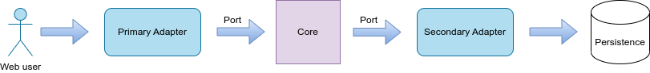
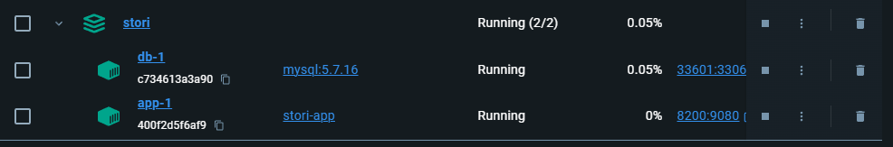
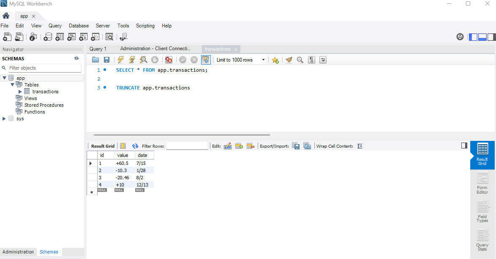
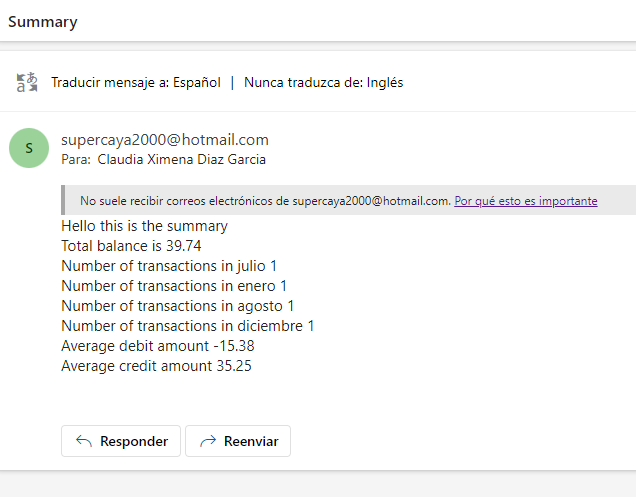

# Stori Card challenge

## Architecture

This project is using the Hexagonal architecture, the distribution of the layers are like this:


## Unit tests

The project has their unit tests in the operations on layer usecases.

## How to run the project in your local machine

1. You need to install Golang in tu SO: https://go.dev/doc/install
2. Open the project in your console and run the command from the root folder "stori" and run:
```
docker-compose build
docker-compose up -d
```

your docker should be created:



3. Validate the database in mysql:



4. Run the endpoint:
```
curl --location 'http://localhost:8200/v1/transaction/send/email' \
--header 'Content-Type: application/json' \
--data-raw '{
    "to": "cx.diaz@uniandes.edu.co",
    "from": "supercaya2000@hotmail.com",
    "pass": "your email password"
}'
```

5. Then you will receive an email:


